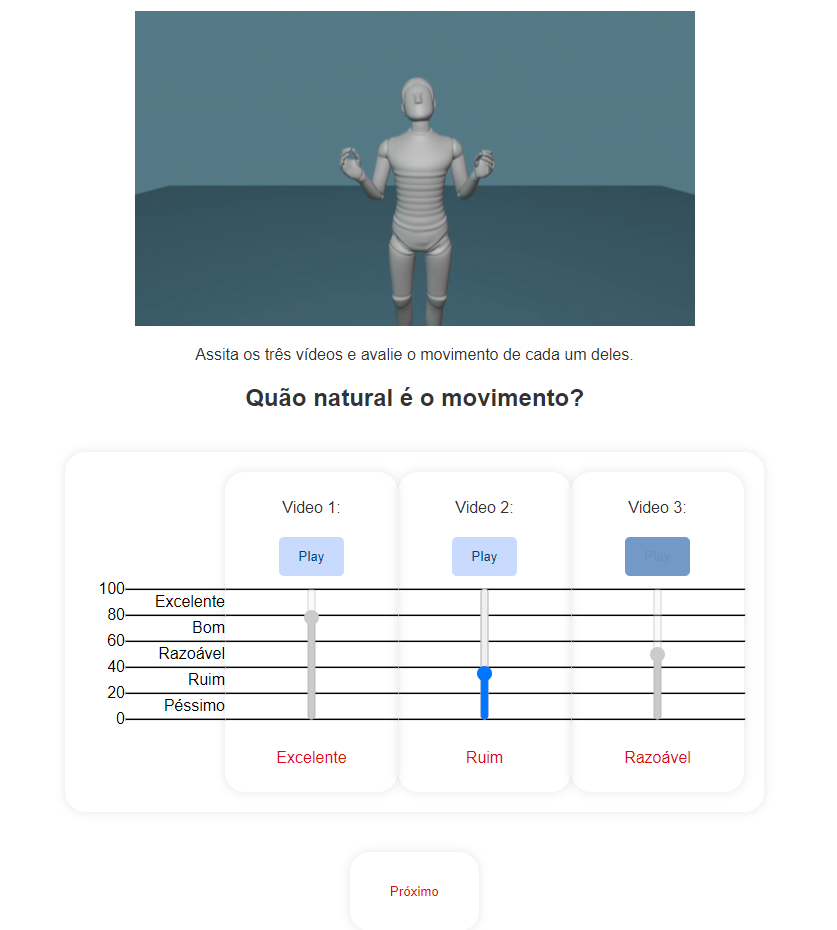
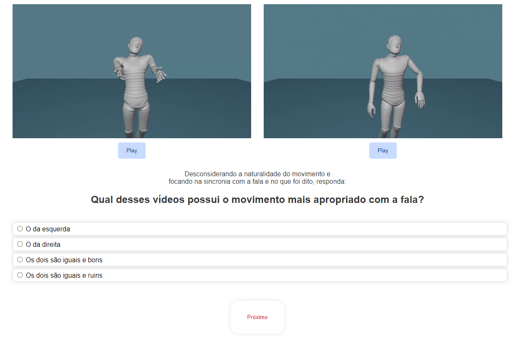

# Multimodal-Perceptual-Evaluation

Welcome to the Multimodal Perceptual Evaluation repository! This repository houses the code necessary to set up and execute perceptual evaluations encompassing diverse media forms (currently supporting video evaluation). Powered by Python Flask, the evaluation system manages server-client interactions, facilitating user participation both locally and online.

The evaluation framework offers versatile templates, supporting various evaluation methodologies including MUSHRA-like tests, AB testing, and single-stimulus evaluations.

Key features include automatic experiment randomization, participant session tracking, and logging and storage of evaluation results.





## FAQ

**How can I use this code?**

Clone or download this repository. The code has been tested on a standard Anaconda installation and should run using it. Run the application using:
```shell
python app.py
```

and access http://127.0.0.1:5000/ using your browser.

**What browser should I use?**

This evaluation has been thoroughly tested on Google Chrome and appears to work fine on Microsoft Edge. However, some issues with a previous version of this code have been reported in Firefox and Safari.

**Where can I host this evaluation?**

The code utilizes Flask (Python) along with standard web frameworks (JavaScript, CSS, HTML). It has been thoroughly tested and performed well on [PythonAnywhere](https://www.pythonanywhere.com/).

## Contribute

Want to contribute? Feel free to create pull requests and issues for bugs and small improvements.

**Are you a student or researcher of the [Artificial Intelligence for Multimodal Signal Processing](https://github.com/ai-unicamp)** 
- ... and want to adapt this repository to your research? Please ensure that you're part of the AI-Unicamp organization on GitHub. Create a new branch in this repository to make your modifications. Please refrain from using the main branch for your research to keep it clear and easy to use for everyone.
- ... and want to contribute with improvements and bug fixes? Please avoid making commits directly to the main branch. Instead, follow these best practices:
    - Create feature branches for each new change or improvement.
    - Submit pull requests to merge your changes into the main branch.
    - Please avoid making commits directly to the main branch.
    - Don't submit broken or incomplete features.
    - Encourage code reviews for all pull requests to maintain code quality.
    - Provide clear documentation on what changed.

## Featured in

List of all works, research papers and thesis featuring the Multimodal Perceptual Evaluation:

- Work in progress...

## Contact

This project was created and it is maintaned by students and researchers of the [Artificial Intelligence for Multimodal Signal Processing](https://github.com/ai-unicamp) from [Unicamp](https://www.unicamp.br/en). Feel free to contact Professor [Paula Dornhofer Paro Costa](https://pdpcosta.github.io/).

## Reference

If you find this library useful, please consider acknowledging it in your work.

This library was inspired mainly by [webMUSHRA](https://github.com/audiolabs/webMUSHRA) and [HEMVIP](https://github.com/jonepatr/hemvip).

